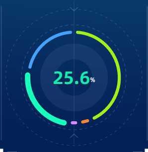

## HTML

这里的 `ring` 和 `ring2` 用作饼图外部的两个虚线圆，他们分别逆时针和顺时针围绕饼图进行循环旋转

```html
<div className="production-scale-pieBar-chart-ring"></div>
<div className="production-scale-pieBar-chart-ring2"></div>
<div className="production-scale-pieBar-chart">
  <RingChart isRender="{true}" dataInit="{pieDataSource}" />
</div>
```

## typescript JSX

这里我们直接采用 `SVFRenderer` 方式渲染整个面板图表，使得面板在运行浏览器上的颗粒度优化度更匹配设计稿

- 为了通用性，我们将他封装成一个外部组件，通过Props动态传参
- `dataInit` 可以当作是后端返回的数据源结构
- `isRender` 视为动态是否需要渲染当前面板的DOM REF
- `colorList` 作为整个面板的饼图各个模块

```typescript jsx
import React, { useEffect, useRef, useState } from "react";
import * as echarts from "echarts/core";
import { SVGRenderer } from "echarts/renderers";
import { GridComponent, LegendComponent } from "echarts/components";
import { BarChart } from "echarts/charts";
echarts.use([GridComponent, LegendComponent, BarChart, SVGRenderer]);
interface IProps {
  isRender?: boolean;
  width?: number;
  height?: number;
  dataInit: { name: string; value: number | string; capacity?: string }[];
}

const colorList: any = {
  煤电: "rgba(248, 133, 49, 1)",
  气电: "rgba(218, 139, 255, 1)",
  光伏: "rgba(160, 240, 29, 1)",
  风电: "rgba(20, 238, 172, 1)",
  水电: "rgba(69, 162, 250, 1)",
  环保: "rgba(255, 235, 166, 1)",
  城市燃气: "rgba(246, 46, 33, 1)",
};

const RingChart: React.FC<IProps> = (props) => {
  const { isRender, width, height, dataInit = [] } = props;
  const chartRef = useRef<HTMLDivElement>(null);
  const chartInstance = useRef<echarts.ECharts | null>(null);
  // const [data, setData] = useState(dataInit);
  const [current, setCurrect] = useState(0);
  const highlight = (pre: number, cur: number) => {
    chartInstance.current?.dispatchAction({
      type: "downplay",
      seriesIndex: 0,
      dataIndex: pre,
    });

    chartInstance.current?.dispatchAction({
      type: "highlight",
      seriesIndex: 0,
      dataIndex: cur,
    });

    // 显示 tooltip
    chartInstance.current?.dispatchAction({
      type: "select",
      seriesIndex: 0,
      dataIndex: cur,
    });
  };

  useEffect(() => {
    if (isRender && chartRef && chartRef.current) {
      const options: any = {
        color: dataInit.map((e) => colorList[e.name]),
        textStyle: { fontFamily: "AlibabaPuHuiTi" },
        series: [
          {
            type: "pie",
            radius: ["84%", "90%"],
            center: ["50%", "50%"],
            avoidLabelOverlap: false,
            startAngle: 90,
            padAngle: 5,
            itemStyle: {
              borderRadius: 10,
            },
            label: {
              show: false,
              position: "center",
            },
            labelLine: {
              show: false,
            },
            data: dataInit.map((item, index) => ({
              name: item.name,
              value: item.value,
              emphasis: {
                label: {
                  show: true,
                  formatter: (param: any) => {
                    return `{a|${
                      Math.floor(param.percent * 10) / 10
                    }}{b|${"%"}}`;
                  },
                  textStyle: {
                    rich: {
                      a: {
                        fontSize: 40,
                        fontWeight: 700,
                        fontFamily: "AlibabaPuHuiTi",
                        color: colorList[item.name],
                      },
                      b: {
                        fontSize: 14,
                        padding: [10, 0, 0, 0],
                        fontFamily: "AlibabaPuHuiTi",
                        color: "rgba(255, 255, 255, 1)",
                      },
                    },
                  },
                  fontSize: 40,
                  fontWeight: "bold",
                },
              },
            })),
          },
          {
            type: "pie",
            data: [100],
            radius: ["35%", "65%"],
            center: ["50%", "50%"],
            itemStyle: {
              normal: {
                color: "rgba(150, 170, 232, .1)",
              },
            },
            silent: true,
            labelLine: {
              normal: {
                show: false,
              },
            },
          },
        ],
      };
      chartInstance.current = echarts.init(chartRef.current, null, {
        renderer: "svg",
      });
      chartInstance.current.setOption(options);
      highlight(-1, 0);
    }

    return () => {
      chartInstance && chartInstance.current?.dispose();
    };
  }, [isRender, dataInit]);

  useEffect(() => {
    const timer = setTimeout(() => {
      if (current >= dataInit.length - 1) {
        setCurrect(0);
        highlight(dataInit.length - 1, 0);
      } else {
        setCurrect(current + 1);
        highlight(current, current + 1);
      }
    }, 3000);
    return () => {
      clearTimeout(timer);
    };
  }, [current, dataInit]);

  return (
    <div
      ref={chartRef}
      style={{
        width: width || "100%",
        height: height || "100%",
        pointerEvents: "none",
      }}
    />
  );
};

export default RingChart;
```

## CSS

`animation` 这里主要是构建两个内圆和外圆包裹饼图，圆内分别进行逆时针和顺时针旋转

```less
.production-scale-pieBar-chart-ring {
  position: absolute;
  top: 50%;
  left: 50%;
  transform: translate(-50%, -50%);
  width: 235px;
  height: 235px;
  background: url(/images/home/home-guangdong-territory-left-row2-productionscale-chart-ring.webp)
    center no-repeat;
  background-size: 100% 100%;
  animation: production-scale-pieBar-chart-ring-rotate 25s infinite linear;
}

.production-scale-pieBar-chart-ring2 {
  position: absolute;
  top: 50%;
  left: 50%;
  transform: translate(-50%, -50%);
  width: 307px;
  height: 307px;
  background: url(/images/home/home-guangdong-territory-left-row2-productionscale-chart-ring2.webp)
    center no-repeat;
  background-size: 100% 100%;
  animation: production-scale-pieBar-chart-ring-rotate2 25s infinite linear;
}
@keyframes production-scale-pieBar-chart-ring-rotate {
  0% {
    transform: translate(-50%, -50%) rotate(0deg);
  }

  100% {
    transform: translate(-50%, -50%) rotate(360deg);
  }
}

@keyframes production-scale-pieBar-chart-ring-rotate2 {
  0% {
    transform: translate(-50%, -50%) rotate(0deg);
  }

  100% {
    transform: translate(-50%, -50%) rotate(-360deg);
  }
}
```

## 效果图


