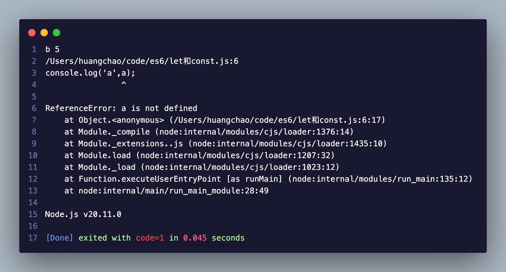
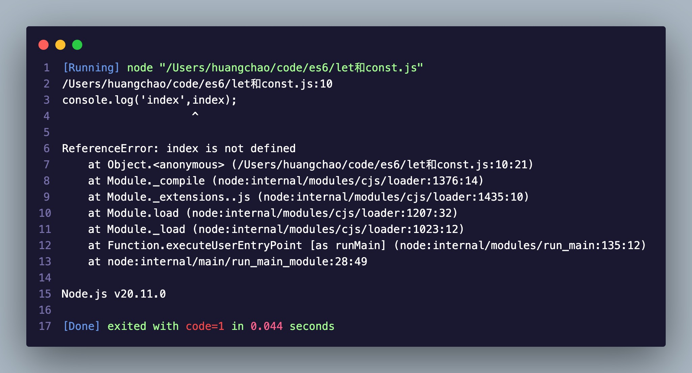
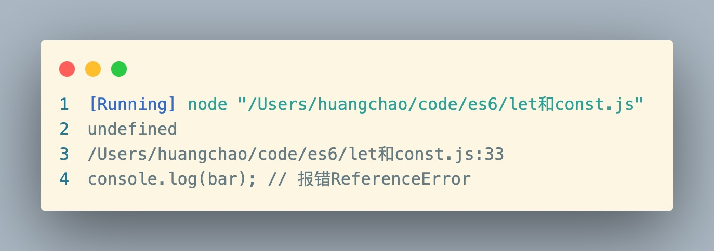
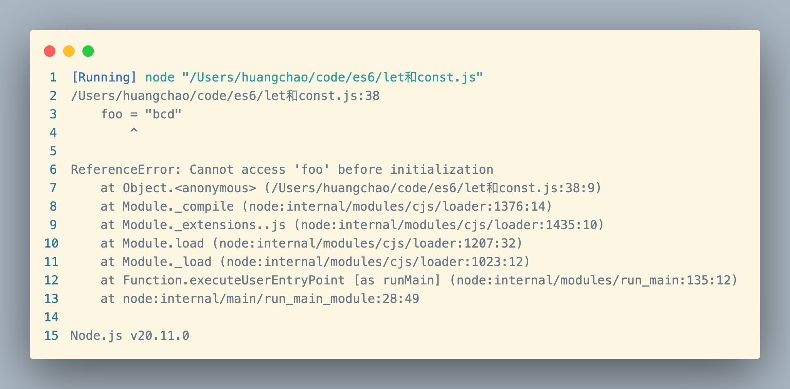

## 基本用法

ES6新增了let命令，用来声明存储变量。作用类似于var，但是let只在代码看内起效.

```javascript
{
  let a = 10;
  var b = 5;
}
console.log("b", b);
console.log("a", a); //直接报错
```



所以 `let` 在 `for` 循环中结合使用就很适合

```javascript
for (let index = 0; index < 10; index++) {}
console.log("index", index);
```



如果使用 `var` 会出现的情况

```javascript
var a = [];
for (var i = 0; i < 10; i++) {
  a[i] = function () {
    console.log(i);
  };
}
a[6](); // 10
```

💡：上面代码中，设置循环变量和循环体内的变量i都是指向全局的，导致获取的始终是最终的那一次结果

换成 `let`

```javascript
var a = [];
for (let i = 0; i < 10; i++) {
  a[i] = function () {
    console.log(i);
  };
}
a[6](); // 6
```

💡：上面通过let声明的i，此时的i只在当前循环的这一轮中存在作用，所以每次循环出来的i值都是一个新的值赋予 `a[i]`

### for循环特别之处

```javascript
for (let index = 0; index < 3; index++) {
  let index = 1;
  console.log("index", index);
}
// 1
// 1
// 1
```

💡：这是因为for循环在设置循环变量 `index` 那一刻就是一个父作用域，循环体内是单独的作用域，所以每次循环输出的都是同样的结果 1

## `var` 严格意义上来说是一个 `bug`

解决掉变量提示的情况

```javascript
// var
console.log(foo); // 输出undefined
var foo = 2;

// let
console.log(bar);
let bar = 2;
```


💡：原因就是脚本执行时，foo已经被提升到最前面 `var foo` ,但此时未赋值，所以输出 `undefined` ，`let` 直接通过报错避免掉出现这个问题，简单直接

## 暂时性死区-TDZ

只要在当前块级作用域内存在 `let` 定义的变量，就不会被外界干扰，声明的变量就此绑定这个区域

```javascript
var foo = "abc";
if (true) {
  foo = "bcd";
  let foo;
}
```



💡：变量 `foo` 在 `if` 这个作用域内被绑定，在被 `let` 定义前执行，就会直接报错。ES6 明确规定，如果区块中存在let和const命令，这个区块对这些命令声明的变量，从一开始就形成了封闭作用域

```js
if (true) {
  // TDZ开始
  tmp = "abc"; // ReferenceError
  console.log(tmp); // ReferenceError

  let tmp; // TDZ结束
  console.log(tmp); // undefined

  tmp = 123;
  console.log(tmp); // 123
}
```

## 不允许重复声明

```javascript
function func(arg) {
  let arg;
}
func(); // error

function func(arg) {
  {
    let arg;
  }
}
func(); // success
```

## ES6块级作用域

```js
function foo() {
  let a = 5;
  if (true) {
    let a = 10;
  }
  console.log(a); // 5
}
```

💡：上面代码表示外层作用域内的变量不受内层作用域内变量影响，这里相当于有两个作用域，分别是函数层作用 `if` 块层的作用域

## const

`const` 声明一个只读的常量。一旦声明，常量的值就不能改变。

```js
const PI = 3.1415;
PI; // 3.1415

PI = 3;
// TypeError: Assignment to constant variable.
```

### 本质

`const` 实际上保证的，并不是变量的值不得改动，而是变量指向的那个内存地址所保存的数据不得改动。对于简单类型的数据（数值、字符串、布尔值），值就保存在变量指向的那个内存地址，因此等同于常量

```js
const foo = {};

// 为 foo 添加一个属性，可以成功
foo.prop = 123;
foo.prop; // 123

// 将 foo 指向另一个对象，就会报错
foo = {}; // TypeError: "foo" is read-only
```

💡：上面代码 `const` 只能保证这个指针是固定的（即总是指向另一个固定的地址），至于它指向的数据结构是不是可变的，就完全不能控制了。因此，将一个对象声明为常量必须非常小心。

同样

```js
const a = [];
a.push('Hello'); ✅
a.length = 0;    ✅
a = ['world'];   ❌
```
