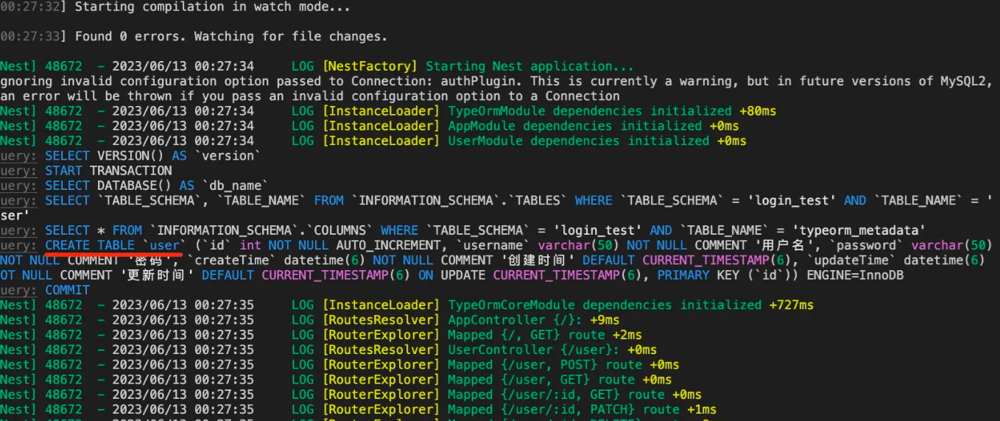

## Mysql

创建个新的 database

```sql
CREATE SCHEMA login_test DEFAULT CHARACTER SET utf8mb4;
```

## 安装 typeorm 相关的包

```sql
npm install --save @nestjs/typeorm typeorm mysql2
```

## 在开始之前，首先明确什么是ORM？

- 简单来说就是数据库操作插件
- 提供反向配置数据库表，创建数据库连接池
- 例如，code first，这个概念第一次是从 `.net` 常用orm es 中了解到的，这里不做过多叙述
- 总之，就是可以自定义orm `class`，通过配置项，反向生成表，配置表字段，字段类型，主键等其他复杂操作

## AppModule

引入相关的 ORM库 TypeOrmModule，传入 option

```ts
import { Module } from "@nestjs/common";
import { AppController } from "./app.controller";
import { AppService } from "./app.service";
import { TypeOrmModule } from "@nestjs/typeorm";
import { UserModule } from "./user/user.module";
import { JwtModule } from "@nestjs/jwt";

@Module({
  imports: [
    TypeOrmModule.forRoot({
      type: "mysql",
      host: "localhost",
      port: 3306,
      username: "root",
      password: "your password",
      database: "login_test",
      synchronize: true,
      logging: true,
      entities: [],
    }),
    JwtModule.register({
      global: true,
      secret: "huang",
      signOptions: {
        expiresIn: "7d",
      },
    }),
    UserModule,
  ],
  controllers: [AppController],
  providers: [AppService],
})
export class AppModule {}
```

这里主要是数据库配置项，通常只需要配置 `type`, `host`, `port`, `username`, `password`, `database`

```json lines
{
  "type": "mysql", //
  "host": "localhost",
  "port": 3306,
  "username": "root",
  "password": "your password",
  "database": "login_test",
  "synchronize": true,
  "logging": true,
  "entities": []
}
```

现在给 Nest 快速创建一个 User 的 CRUD 模块

```sql
nest g resource user
```

随即在 `app.module.ts` 中引入 User 的 `Entity`

```ts
import { User } from "./user/entities/user.entity";
entities: [User];
```

## Entity 实体类

- 映射到数据库表，配置并且生成数据库表字段，属性的基础类，可以自定义字段类型，字段名称等
- 给 User Entity 添加一些属性，详情可见 https://typeorm.bootcss.com/entities
- PrimaryGeneratedColumn 自动增量的主键值，如果需要用到 uuid 生成 `PrimaryGeneratedColumn("uuid")`
- 这里的 @CreateDateColumn 和 @UpdateDateColumn 都是 `datetime` 类型。

```ts
import {
  Column,
  CreateDateColumn,
  Entity,
  PrimaryGeneratedColumn,
  UpdateDateColumn,
} from "typeorm";

@Entity() //标记表明这是一个实体类
export class User {
  @PrimaryGeneratedColumn() //默认 int 自增
  id: number;

  @Column({
    length: 50,
    comment: "用户名",
  })
  username: string;

  @Column({
    length: 50,
    comment: "密码",
  })
  password: string;

  @CreateDateColumn({
    comment: "创建时间",
  })
  createTime: Date;

  @UpdateDateColumn({
    comment: "更新时间",
  })
  updateTime: Date;
}
```

然后跑下服务

```sql
npm run start:dev
```



在 UserModule 模块 引入 TypeOrm.forFeature 动态模块，传入 User 的 `entity`

```ts
import { Module } from "@nestjs/common";
import { UserService } from "./user.service";
import { UserController } from "./user.controller";
import { TypeOrmModule } from "@nestjs/typeorm";
import { User } from "./entities/user.entity";

@Module({
  imports: [TypeOrmModule.forFeature([User])],
  controllers: [UserController],
  providers: [UserService],
})
export class UserModule {}
```

在 service 模块注入对应的 `Repository`

```ts
@Injectable()
export class UserService {
  @InjectRepository(User)
  private userRepository: Repository<User>;
}
```

随后在 UserController 分别添加 login、register 方法

```ts
import { Body, Controller, Inject, Post } from "@nestjs/common";
import { UserService } from "./user.service";

@Controller("user")
export class UserController {
  constructor(private readonly userService: UserService) {}
  @Post("login")
  async login() {}
  @Post("register")
  register() {}
}
```

接下来就是构造 `dto` 的时间了，这里不清楚 `dto` 作用的可以看之前发过的文章

- 需要在 Controller 中用到这两个 dto

```ts
export class LoginDto {
  username: string;
  password: string;
}
```

```ts
export class RegisterDto {
  username: string;
  password: string;
}
```

UserController

- 使用这两个 `dto` 来接收客户端传递过来的参数
- 自行通过 postman 进行测试，可以在终端打印对应 `username` 和 `password` 代表已经成功

```ts
import { Body, Controller, Inject, Post } from "@nestjs/common";
import { UserService } from "./user.service";

@Controller("user")
export class UserController {
  constructor(private readonly userService: UserService) {}
  @Post("login")
  async login(@Body() user: LoginDto) {
    console.log(user);
  }
  @Post("register")
  register(@Body() user: RegisterDto) {
    console.log(user);
  }
}
```

然后去实现具体的功能，先实现注册

- 通过构造方法，将 `UserService` 向外暴露，这样外部的 Controller 就可以通过实例调用到 `service` 层的逻辑方法

```ts
import { Body, Controller, Inject, Post } from "@nestjs/common";
import { UserService } from "./user.service";

@Controller("user")
export class UserController {
  constructor(private readonly userService: UserService) {}
  @Post("register")
  async register(@Body() user: RegisterDto) {
    return await this.userService.register(user);
  }
}
```

接下来看看 `UserService` 注册具体逻辑怎么实现

- `@InjectRepository()` 作为装饰器，可以将 `UsersRepository` 注入到 `UserService` 中，避免 Service 层的 `重复实例化`，`AOP` 理念之一
- 这里的判断逻辑仅判断是否存在用户名，已存在就直接抛出异常，反之直接将 Object 存储到新的实例化对象
- `save` 方法执行数据库插入操作
- `md5` 加密选项个人认为没必要，但是这里还是处理一下吧

```ts
import { RegisterDto } from "./dto/register.dto";
import { HttpException, HttpStatus, Injectable, Logger } from "@nestjs/common";
import { InjectRepository } from "@nestjs/typeorm";
import { Repository } from "typeorm";
import { User } from "./entities/user.entity";
import * as crypto from "crypto";

function md5(str) {
  const hash = crypto.createHash("md5");
  hash.update(str);
  return hash.digest("hex");
}

@Injectable()
export class UserService {
  private logger = new Logger();

  @InjectRepository(User)
  private userRepository: Repository<User>;

  async register(user: RegisterDto) {
    const foundUser = await this.userRepository.findOneBy({
      username: user.username,
    });

    if (foundUser) {
      throw new HttpException("用户已存在", 200);
    }

    const newUser = new User();
    newUser.username = user.username;
    newUser.password = md5(user.password);

    try {
      await this.userRepository.save(newUser);
      return "注册成功";
    } catch (e) {
      this.logger.error(e, UserService);
      return "注册失败";
    }
  }
}
```
