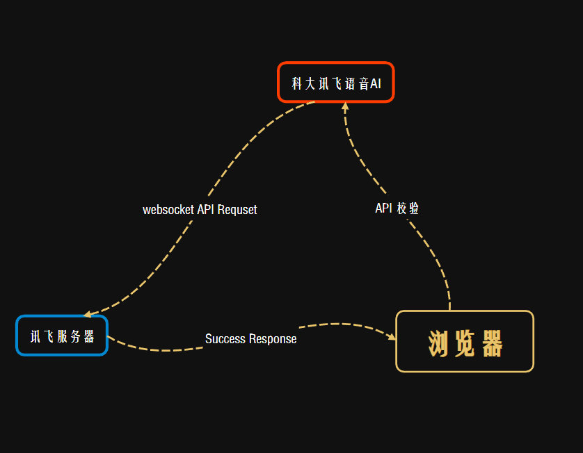

# 前言

&nbsp;&nbsp;&nbsp;&nbsp;语音听写：主要采用浏览器内置的语音系统，并基于科大讯飞流式 `API` 进行开发。它用于1分钟内的即时语音转文本技术，支持实时返回识别
结果，达到一边上传音频一边获得识别结果，它支持8k和16k采样率，16bit和单声道pcm的音频格式，单次静默时长最到可持续60s。
还支持配置多种小语种等高阶功能。

&nbsp;&nbsp;&nbsp;&nbsp;语音合成：主要是将文字消息转换为音频信息，具体可以表现为通过浏览器audio原件，将音频发送至
audio元件以此来在页面中播报对应的语音内容。

&nbsp;&nbsp;&nbsp;&nbsp;该语音能力是通过 `Websocket API` 的方式提供给开发者一个通用的接口。`Websocket API`
具备流式传输的能力，适用于需要流式数据传输
的AI服务场景，比如边说话边识别，相较于SDK，API具有轻量级，跨语言的特点。相较于 `HTTP API`，`Websocket API` 协议具有原生支持跨域的优势。

如下图：



# 语音识别

这是一个语音转文本的过程

接口调用流程步骤如下：

- 通过接口密钥基于 `hmac-sha256` 计算签名，向服务器端发送Websocket协议握手请求
- 握手成功后，客户端通过websocket连接同时上传和接收数据。数据上传完毕，客户端需要上传以此数据结束标识
- 接收到服务器端的结果全部返回标识后断开Websocket连接

## 接口鉴权

在握手阶段，请求方需要对请求进行签名，服务端通过前面来校验请求的合法性
|参数|类型|说明|是否必须|
|:---:|:---:|:---:|:---:|
|host|string|请求主机|是|
|date|string|当前时间戳，RFC123格式|是|
|authorization|string|使用base64编码签名相关的信息|是|

## 如何二次集成

> 注意：需要提前获取到官方提供的鉴权密钥（根据需要选择套餐购买）

定义一个 `DiscernClass` 公共类

```ts
import Crypto from "crypto-js";
import EventEmitter from "events";

interface IAIOptions {
  APPID: string;
  APIKEY: string;
  APISECRET: string;
}

/**
 * @description 语音识别内部类
 * @param APP 应用ID
 * @param API_KEY 接口授权 KEY
 * @param API_SECRET 接口授权密钥 SECRET
 * @param seconds 录音持续时长（60s）
 * @param socket
 * @param rocorder 讯飞内置音频类
 * @param result 识别结果
 */
export default class DiscernClass extends EventEmitter {
  private APP_ID: string;
  private API_KEY: string;
  private API_SECRET: string;
  private seconds: number = 0;
  private ws?: WebSocket;
  private recorder?: RecorderManager;
  private countdownInterval?: NodeJS.Timeout;
  private resultText: string = ""; //识别结果（根据需要是否暴露）
  constructor(options: IAIOptions) {
    super();
    this.APP_ID = options.APPID;
    this.API_KEY = options.APIKEY;
    this.API_SECRET = options.APISECRET;
    this.recorder = new RecorderManager("/kfspeech/discern"); //单独配置到项目下，不然可能会出现空引用情况
  }
}
```

接口鉴权，会返回一个鉴权好的 `ws url` 根据这个 `url` 发起讯飞 `WebSocket` 请求

```ts
const getWebSocketUrl = (): string => {
  const url = XF_DISCERNWSSURL;
  const host = XF_DISCERNHOST;
  const apiKey = this.API_KEY;
  const apiSecret = this.API_SECRET;
  const date = new Date().toUTCString();
  const algorithm = "hmac-sha256";
  const headers = "host date request-line";
  const signatureOrigin = `host: ${host}\ndate: ${date}\nGET /v2/iat HTTP/1.1`;
  const signatureSha = CryptoJS.HmacSHA256(signatureOrigin, apiSecret);
  const signature = CryptoJS.enc.Base64.stringify(signatureSha);
  const authorizationOrigin = `api_key="${apiKey}", algorithm="${algorithm}", headers="${headers}", signature="${signature}"`;
  const authorization = btoa(authorizationOrigin);
  return `${url}?authorization=${authorization}&date=${date}&host=${host}`;
};
```

在业务数据流参数中 `audio` 音频内容，需要采用 `base64` 编码格式传递

```ts
const toBase64 = (buffer: ArrayBuffer): string => {
  const binary = String.fromCharCode(...new Uint8Array(buffer));
  return window.btoa(binary);
};
```

创建请求，发起 `WebSocket` 请求连接讯飞服务，请求示例参数：

```json
{
  "common": {
    "app_id": "xxx"
  },
  "business": {
    "language": "zh_cn",
    "domain": "iat",
    "accent": "mandarin"
  },
  "data": {
    "status": 0,
    "format": "audio/L16;rate=16000",
    "encoding": "raw",
    "audio": "exSI6ICJlbiIsCgkgICAgInBvc2l0aW9uIjogImZhbHNlIgoJf..."
  }
}
```

连接方法 `frameSize` 为每一帧音频大小的整数倍，`sampleRate` 表示音频采样率。

```ts
const connectWebSocket = () => {
  const url = this.getWebSocketUrl();
  this.ws = new WebSocket(url);
  this.ws.onopen = () => {
    this.recorder?.start({
      sampleRate: 16000,
      frameSize: 1280,
    });
    const params = {
      common: {
        app_id: this.APP_ID,
      },
      business: {
        language: "zh_cn",
        domain: "iat",
        accent: "mandarin",
        vad_eos: 60000, // 静默状态时长(测试最长静默时间为30s)
        dwa: "wpgs",
        ptt: 0, //不要识别标点符号
      },
      data: {
        status: 0,
        format: "audio/L16;rate=16000",
        encoding: "raw",
      },
    };
    this.ws?.send(JSON.stringify(params));
  };
  this.ws.onmessage = e => this.renderResult(e.data as string);
  this.ws.onclose = () => {
    this.recorder?.stop();
    console.log("断开连接");
    this.emit("closed");
  };
  this.ws.onerror = () => {
    this.recorder?.stop();
  };
};
```

解析请求成功后的收音结果，每次捕获到的数据都会重置上一次捕获到的音频，防止捕获到的音频字符串内容过长

```ts
const renderResult = (resultData: string) => {
  try {
    const jsonData = JSON.parse(resultData);
    if (jsonData.data && jsonData.data.result) {
      const data = jsonData.data.result;
      let str = "";
      const ws = data.ws;
      for (let i = 0; i < ws.length; i++) {
        str += ws[i].cw[0].w;
      }
      this.text = str;
    }
    if (jsonData.code === 0 && jsonData.data.status === 2) {
      this.ws?.close();
    }
    if (jsonData.code !== 0) {
      this.ws?.close();
    }
  } catch (error) {
    console.error("发送错误", error);
  }
};
```

这里通过 `Event` 事件的 `emit` 向外（发射）出一个事件，调用者通过监听器（listener）来响应这个事件。
也可以称为事件驱动。允许创建和处理自定义事件

```
  set text(value) {
    this.resultText = value;
    this.emit('change', value);
  }
  get text() {
    return this.resultText;
  }
```
