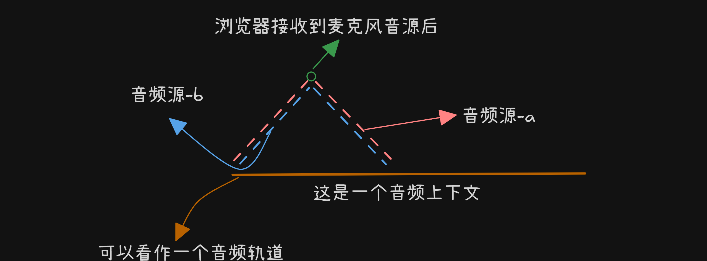

#### 前言

> 因为在项目中涉及到了浏览器音频处理的功能，发现以前没了解过，这次就来梳理下是怎么运行的

### 浏览器内置音频处理器 Web Audio API

根据我画的图例，从输入到输出 我们可以把每个音源都当作是一个 `audioChunks` 而这个 chunks（虚线） 并非一次性发送，而是切割成每个
`audioBufferSourceNode` 一段一段的，包装成一个数组。

`audioBufferSourceNode？`

它就是表示一个音频源，包含存储在内存中的音频数据，存储在 `ArrayBuffer` 对象中

`AudioCOntext.destination`

音频源-a/b：可以看作就是一个音频文件，而音频文件本身就是音频采样数据，一秒钟可以采样几万个片段
通过顶端多个节点进行连接，最后连接到一个目的地 `AudioCOntext.destination` 通过他
来负责把声音传输出去（扬声器/耳机）等设备

